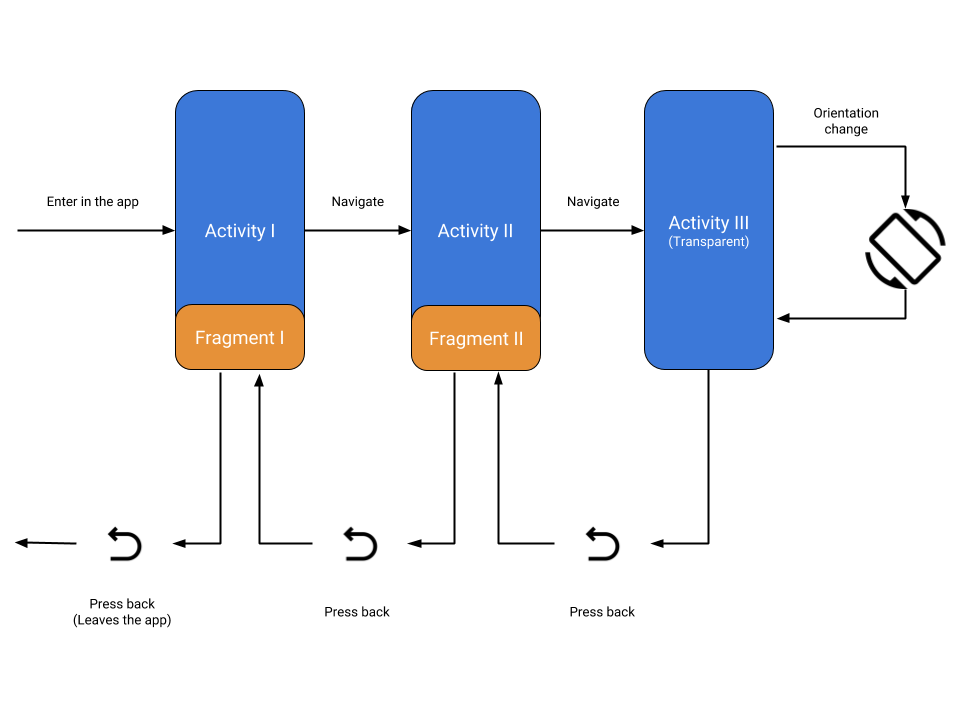

# Android Lifecycle Case Study

## Intro
My idea with this repository is to create a case study of a complex Android
(Activity + Fragment) lifecycle flow. To conduct the study I created:
* The Activity #1 containing the Fragment #1
* The Activity #2 containing the Fragment #2
* A Transparent Activity

To learn about the Android lifecycle behaviour. I followed this example:

* The user enters in the app and sees the first activity
* The user navigates and see the second activity
* The user invokes a transparent activity
* The user changes the screen orientation
* The user presses back, removing the transparent activity from the top of the stack
* The user presses back, removing the second activity from the top of the stack
* The user presses back, leaving the app

All the knowledge learned is published in this [Medium post](https://medium.com/@phellipealexandre/ciclo-de-vida-no-android-um-estudo-de-caso-65d59398ab6f) (just in portuguese for now).

## Considerations
Fell free to use this repository in the way you want. Happy studies!
